Purpose:
========

The purpose of the Calm lab is to introduce participants to Nutanix REST
API’s and Calm blueprints to automate cluster provisioning, and
application deployment workflows.

Scope:
======

The scope of the Calm lab will walk participants through navigating the
Calm toolchain, creating blueprints, and executing the blueprints
against a Nutanix Cluster using a NUC.

Requirements:
=============

The following is a list of hardware and software requirements needed to
execute and complete the lab.

#### **Prerequisites**

-   Understanding of HTTP, and REST.

-   Comfortable with Bash/Batch shell scripting, or other programming
    language/runtime.

-   Familiar with both Calm IO™ and Prism Element™

#### **Hardware**

-   HPOCS Nutanix Hardware

-   Laptop, 10Base-T, CAT5/CAT6 ethernet cable.

#### **Software**

-   Calm-183.qcow

-   CentOS Server v7.qcow (smb://pocfs.nutanixdc.local/iso).

Creating and Running Calm Blueprints:
=====================================

In the following sections, the exercises will lead with creating a basic
1-step Calm Blueprint. This blueprint will deploy a Nutanix AHV VM based
on the Image Service images created earlier. Once you’ve mastered a
basic blueprint, the lab exercise will guide you through creating a
slightly more complex blueprint, introducing dependencies and
post-deployment tasks.

{height="50px" width="50px"} **STOP:** In the following lab exercises,
Calm requires QCOW (Quick Emulator Copy-On-Write), Images to deploy and
manage. This implies that the CentOS image to be used in the following
exercises needs to be qcow formatted and staged as Type “DISK”, using
Prism Element’s Image Service. If a CentOS qcow image is not available,
stop and notify facilitator.

Web Application Blueprint:
--------------------------

This exercise creates a slightly more complex blueprint. The exercise
will introduce dependencies and post-deployment tasks for creating a Web
Application Server and backend Database.

1.  Using a Web Browser (Chrome recommended) establish a session with
    Prism element, insure the Calm VM is running (powered on). Verify
    Calm Server IP Address.

2.  Using a Web Browser (Chrome recommended) establish a session with
    Calm Server VM using &lt;IP Address&gt; as shown for VM in Prism
    Element. Login as needed.

3.  Create a new Blueprint by clicking the **+CREATE BLUEPRINT** button
    located at the top of the Blueprints dashboard.

<!-- -->

4.  The Blueprint editor-canvas should appear as follows:

    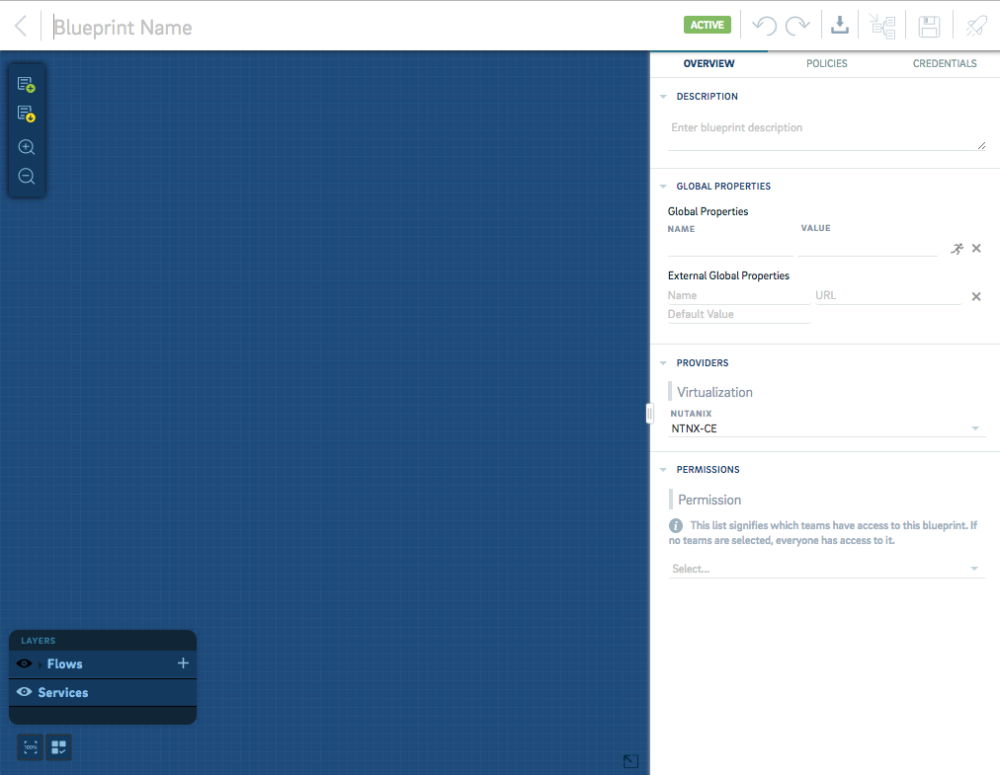
   

5.  With the Blueprint editor-canvas opened, enter the following:

    a.  **Blueprint name:** Deploy Web Application

    b.  **Description:** Deploy MySQL Server and NGINX Server on AHV.

    c.  **Provider:** NTNX-CE

        **Note:** The NGINX VM depends on the MySQL VM deployment being
        successful.

<!-- -->

8.  Create/Add a Service by clicking the **Add Service**
     Icon, located in the upper left of
    the Blueprint canvas.

9.  A new Service Icon
    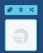 should appear on the Blueprint
    canvas.

10. To the Right of the Blueprint canvas there are set of fields
    describing the Service. The fields should be set as follows:

    a.  Service name: *“Deploy DB Server”*

    b.  Under the **PROVIDERS** section, set the **PROVIDER** field by
        clicking the dropdown menu and selecting *“Provision Nutanix”.*

    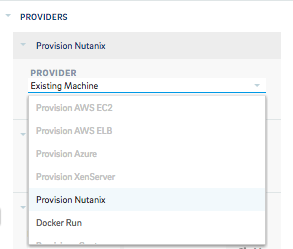

    c.  Under **CONFIGURATION** set the fields as illustrated below:

        i.  VM NAME: DB Server

        ii. IMAGE: \[*Select the CentOS QCOW Image configured w/Image
            Services*\]

        iii. NETWORK: vlan.0

        iv. VCPUS: 1

        v.  MEMORY(MB): 1024

        vi. CORES PER VCPU: 2

    d.  Configure credentials for the VM.

        **Note:** Credentials are required for performing
        post-deployment operations/tasks

    e.  Create a credential by clicking on the dropdown menu under
        **CREDENTIAL**

    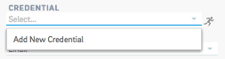

    f.  Click **Add New Credential**. This exercise requires username &
        password authentication only. Add the credentials for the VM
        user: root, password: nutanix/4u. Click **Add** button to save
        credential.

    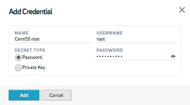

8.  Save the Blueprint by clicking the
    **Save** Icon located to the right of Calm’s
    Toolbar.

9.  The Icon should appear as
     checked when successfully saved.

10. Click the LAYERS + sign to expand (if needed). Select or click on
    ‘*create-action’*. The Blueprint canvas should appear as follows:

    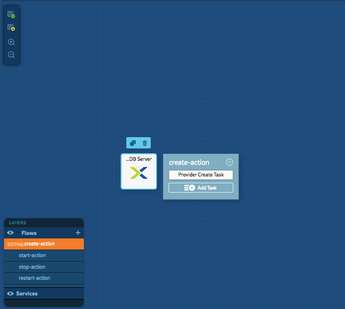

> **Note:** In the following steps involving any Calm Shell commands, be
> sure to add the following as the first command:
> 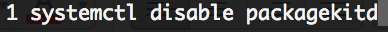

8.  Click the ‘Add Task’ button in the create-action window anchored to
    the DB Server service, and complete the fields as shown below.

    **Note:** Calm automatically links the provision and task items.

> 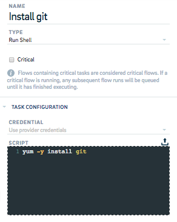

8.  Save the Task by clicking the
    **Save** Icon located to the right of Calm’s
    Toolbar.

9.  The Icon should appear as
     checked when successfully saved.

10. Add another Task by clicking the ‘Add Task’ button in the
    create-action window anchored to the DB Server service, and complete
    the fields as shown below.

    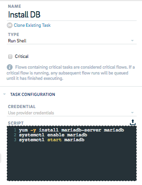

11. Save the Task by clicking the
    **Save** Icon located to the right of Calm’s
    Toolbar.

12. The Icon should appear as
     checked when successfully saved.

13. Create the Application Server by adding another service to the
    Blueprint.

14. Add the Service by clicking the **Add Service**
     Icon, located in the upper left of
    the Blueprint canvas.

15. Another Service Icon
     should appear on the Blueprint
    canvas.

16. To the Right of the Blueprint canvas set the fields describing the
    Service. The fields should be set as follows:

    a.  Service name: *“Deploy App Server”*

    b.  Under the **PROVIDERS** section, set the **PROVIDER** field by
        clicking the dropdown menu and selecting *“Provision Nutanix”.*

17. Under **CONFIGURATION** set the fields as illustrated below:

    i.  VM NAME: App Server

    ii. IMAGE: \[*Select the CentOS QCOW Image configured w/Image
        Services*\]

    iii. NETWORK: vlan.0

    iv. VCPUS: 1

    v.  MEMORY(MB): 1024

    vi. CORES PER VCPU: 2

        **Note:** New credentials are NOT required for the App Service.
        It will use the same authentication as DB Server.

18. Save the Blueprint by clicking the
    **Save**  Icon located to the right of Calm’s
    Toolbar.

19. The Icon should appear as
     checked when successfully saved.

20. Click the ‘Add Task’ button in the create-action window anchored to
    the App Server service, and complete the fields as shown below.

> 

8.  Add a 2nd task by clicking the ‘Add Task’ button in the
    create-action window anchored to the App Server service, and
    complete the fields as shown below.

    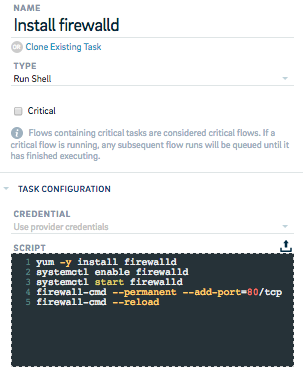

9.  Add a 3rd task by clicking the ‘Add Task’ button in the
    create-action window anchored to the App Server service, and
    complete the fields as shown below.

    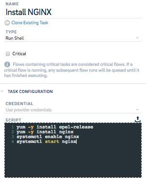

10. Save the Blueprint by clicking the
    **Save** Icon located to the right of Calm’s
    Toolbar.

11. The Icon should appear as
     checked when successfully saved.

12. In this exercise, we’ve created two separate services that contain
    their own associated tasks. Currently, the tasks are not ‘aware’ of
    each other - Calm will assume they can safely be run in any order.
    To complete the Blueprint, we’ll need to serialize the services,
    provisioning the database server *before* the application server.

13. To accomplish this, click the ‘Install DB’ task, then click the
    small arrow that appears.

> 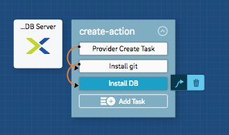

8.  Using the dependency arrow ‘move’ mode enabled, click the ‘Provider
    Create Task’ task within the ‘Deploy App Server’ service. The
    Blueprint should look as follows:

> 

8.  Save the Blueprint by clicking the
    **Save** Icon located to the right of Calm’s
    Toolbar.

9.  The Icon should appear as
     checked when successfully saved.

10. Test, establish a deployment-name, and run the Blueprint by clicking
    the **Rocket**
     Icon located to the right of Calm’s
    Toolbar.

11. Add **DEPLOYMENT NAME**: “*Deploy Web App*”. Click the
    **Validate** Icon. Blueprint is valid when the
    **Checked**
     Icon appears next to the **Validate**
    Icon.

    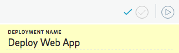

12. If the Blueprint was successfully validated, click the **Play**
    {width="0.20945538057742782in"
    height="0.1795330271216098in"} Icon to launch the deployment. The
    Deployment Status screen should appear showing the deployment as
    **IN-PROGRESS**

    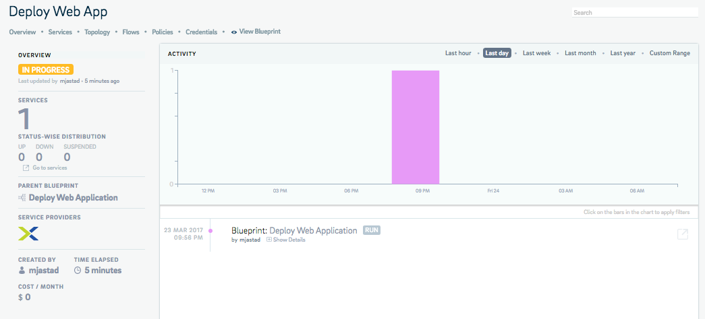

13. Upon successful completion of a deployment, the status should
    transition from **IN-PROGRESS** to **RUNNING**

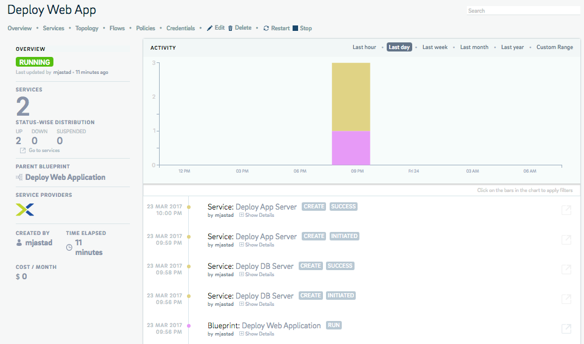

8.  Successful completion of a deployment, and associated tasks can be
    found by scrolling down, below the **Deployment Status** screen in
    **TOPOLOGY** and should appear as follows

    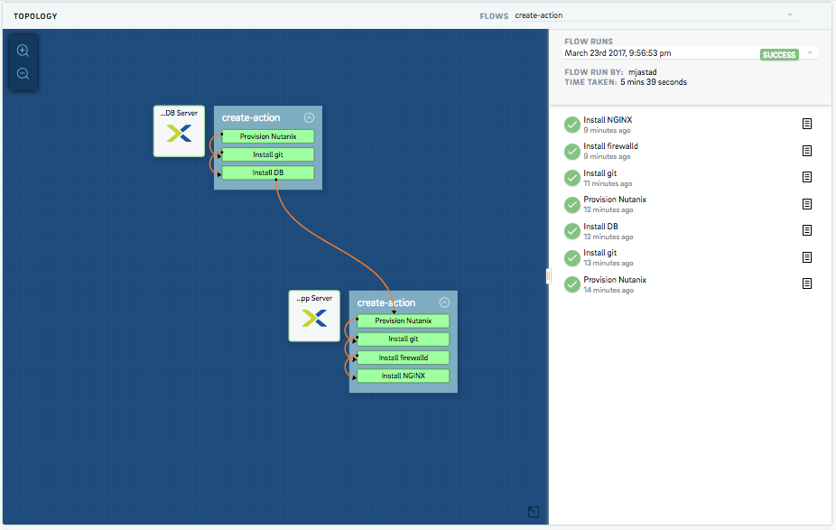

    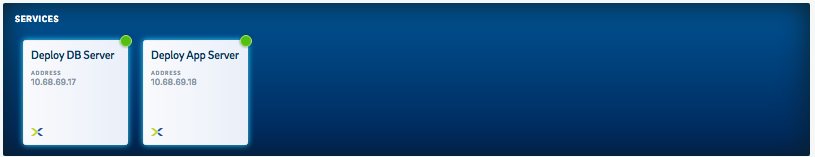

9.  Check Deployment status by clicking the **Deployments**
    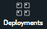 Icon in the left-hand navigation bar
    to manage the deployment. The following should appear:

    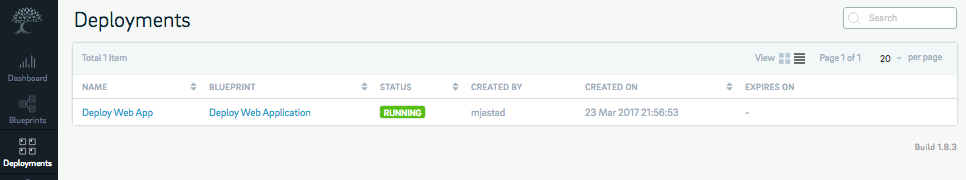

10. Verify the deployment within Prism Element by navigating to the VM
    page in table view. The VM’s function as a normal AHV VM’s that can
    be managed the same as a manually-provisioned AHV VM within Prism
    Element

    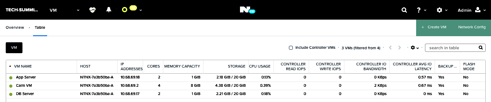

11. Verify the App Server is running by opening a browser (Chrome
    recommended) to establish a session with the server using the IP
    Address - Ref: App Server VM in Prism Element.

    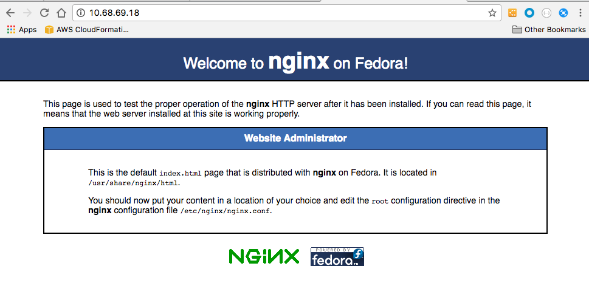

